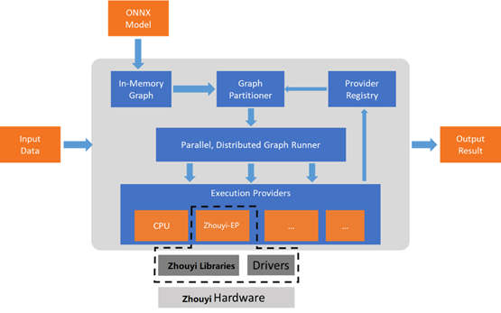

<p align="center"></p>

## Compass ONNX Runtime

**ONNX Runtime is a cross-platform inference and training machine-learning accelerator**.
 [Learn more &rarr;](../README.md)

**Compass ONNX Runtime is a project that adds the Zhouyi NPU Execution Provider to onnxruntime.**.
**The Zhouyi execution provider supports Zhouyi NPU execution. It builds ONNX models to Zhouyi NPU graphs, which can be executed by supported accelerator backend libraries**.

<p align="center"></p>

## Supported platform and architecture:

### Platform

* x86_64 linux
  It will run the Zhouyi NPU simulator.
* aarch64 linux
  It will run the Zhouyi NPU hardware.

### Zhouyi NPU arch

* x2
* x3p

## Build

### prepare aipu-toolkit

The aipu-toolkit is a high-level interface for accessing Zhouyi NPU,
which is included in the "Zhouyi" NPU Compass SDK MiniPkg.
Zhouyi Execution Provider implements deep learning inference on Zhouyi NPU via aipu-toolkit.

| onnxruntime version | MiniPkg version |
| ------------------- | --------------- |
| rel-1.22.0          | 4.1.0           |

### Modify tool_x86.cmake/tool_arm64.cmake to ensure that the gcc path is available.

tool_x86.cmake:

```
SET(CMAKE_SYSTEM_NAME Linux)
SET(CMAKE_SYSTEM_VERSION 1)
SET(CMAKE_C_COMPILER /path/to/gcc)
SET(CMAKE_CXX_COMPILER /path/to/g++)
SET(CMAKE_SYSTEM_PROCESSOR x86_64)
SET(CMAKE_HOST_SYSTEM_PROCESSOR x86_64)
SET(CMAKE_FIND_ROOT_PATH_MODE_PROGRAM NEVER)
SET(CMAKE_FIND_ROOT_PATH_MODE_LIBRARY ONLY)
SET(CMAKE_FIND_ROOT_PATH_MODE_INCLUDE ONLY)
SET(CMAKE_FIND_ROOT_PATH_MODE_PACKAGE ONLY)
```

tool_arm64.cmake:

```
SET(CMAKE_SYSTEM_NAME Linux)
SET(CMAKE_SYSTEM_VERSION 1)
SET(CMAKE_C_COMPILER /path/to/aarch64-none-linux-gnu-gcc)
SET(CMAKE_CXX_COMPILER /path/to/aarch64-none-linux-gnu-g++)
SET(CMAKE_SYSTEM_PROCESSOR aarch64)
SET(CMAKE_HOST_SYSTEM_PROCESSOR x86_64)
SET(CMAKE_FIND_ROOT_PATH_MODE_PROGRAM NEVER)
SET(CMAKE_FIND_ROOT_PATH_MODE_LIBRARY ONLY)
SET(CMAKE_FIND_ROOT_PATH_MODE_INCLUDE ONLY)
SET(CMAKE_FIND_ROOT_PATH_MODE_PACKAGE ONLY)
```

The 'zhouyi_arch' in the following text refers to the following characters:
x2
x3p

#### X86_64

build onnxruntime library

```shell
$ ./build.sh --use_zhouyi --parallel --build_shared_lib --build_dir build_x86 \
--config Debug --skip_tests --skip_submodule_sync --cmake_extra_defines \
AIPU_TOOLKIT_DIR=/path/to/aipu-toolkit/{zhouyi_arch} \
ZHOUYI_RUNTIME_LIB_ARCH=x86_64 \
ZHOUYI_RUNTIME_SIMULATOR=ON \
CMAKE_TOOLCHAIN_FILE=/path/to/tool_x86.cmake
```

build onnxruntime python package

```shell
$ ./build.sh --use_zhouyi --parallel --build_shared_lib --build_dir build_x86 \
--config Debug --skip_tests --build_wheel --cmake_extra_defines \
AIPU_TOOLKIT_DIR=/path/to/aipu-toolkit/{zhouyi_arch} \
ZHOUYI_RUNTIME_LIB_ARCH=x86_64 \
ZHOUYI_RUNTIME_SIMULATOR=ON \
CMAKE_TOOLCHAIN_FILE=/path/to/tool_x86.cmake
```

#### ARM64

build onnxruntime library

```shell
$ ./build.sh --use_zhouyi --parallel --build_shared_lib --build_dir build_arm64 \
--config Debug --skip_tests --skip_submodule_sync --cmake_extra_defines \
AIPU_TOOLKIT_DIR=/path/to/aipu-toolkit/{zhouyi_arch} \
ZHOUYI_RUNTIME_LIB_ARCH=arm64-v8a \
CMAKE_TOOLCHAIN_FILE=/path/to/tool_arm64.cmake
```

build onnxruntime python package

1. Compile successfully using the following command:

```shell
$ ./build.sh --use_zhouyi --parallel --build_shared_lib --build_dir build_arm64 \
--config Debug --skip_tests --skip_submodule_sync --build_wheel --cmake_extra_defines \
AIPU_TOOLKIT_DIR=/path/to/aipu-toolkit/{zhouyi_arch} \
ZHOUYI_RUNTIME_LIB_ARCH=arm64-v8a \
CMAKE_TOOLCHAIN_FILE=/path/to/tool_arm64.cmake
```

2. Push the onnxruntime folder into the aarch64 development board.
   The aarch64 development board needs to install the following modules:
   python3
   Dependencies required for Python packaging:

   | Module   | Minimum version |
   | -------- | --------------- |
   | onnx     | 1.15.0          |
   | protobuf | 5.26.1          |
   | numpy    | 1.22.3          |

   The aarch64 versions of the above modules can be downloaded from the website https://pypi.org.
   If there are other missing modules for the arm64 development board, please install them yourself.
3. Use the following command to package:

```shell
$ cd onnxruntime/build_arm64/Debug
$ python3 ../../setup.py bdist_wheel --use_zhouyi
```

## Test

Prerequisites:

```shell
$ export OPERATOR_PATH=/path/to/aipu-toolkit/{zhouyi_arch}/operator/
```

**X86_64**:

* Base test
  After compilation is complete, use the following command to test:
  ``./build_x86/Debug/onnxruntime_test_all --gtest_filter="ZhouyiExecutionProviderTest.*"``
* Use onnx_test_runner to test all testcase.

```shell
$ ./build_x86/Debug/onnx_test_runner  -e zhouyi path/to/testcase/QLinearAdd_uint8/
```

**ARM64**:
[Deploy_To_Arm_Linux &rarr;](../zhouyi/docs/Deploy_To_Arm_Linux.md)

## Samples

Currently, users can use C++ and Python API on Zhouyi EP.

#### c++

Prerequisites:

```shell
$ export OPERATOR_PATH=/path/to/aipu-toolkit/{zhouyi_arch}/operator/
```

code path:

```
zhouyi/example/c++
```

#### python

Prerequisites: Choose one of the following two methods.

1. Use ZhouyiOperators wheel

```shell
$ pip3 install ZhouyiOperators-xxxx-py3-none-any.whl
```

Add the following to the python file:

```
from ZhouyiOperators import operators
```

2. Use env

```shell
$ export OPERATOR_PATH=/path/to/aipu-toolkit/{zhouyi_arch}/operator/
```

code path:

```
zhouyi/example/python/model
```

Run python example:

```shell
$ python3 run_model.py -m mnist-12-int8/mnist-12-int8.onnx -i mnist-12-int8/input_0.pb
```

#### python with cache mode

1. Generate cache context onnx model: -b: embed_mode, -p: specify filepath of context onnx model

```shell
$ python3 run_model.py -m mnist-12-int8/mnist-12-int8.onnx -i mnist-12-int8/input_0.pb -f
```

2. Runcache context onnx model

```shell
$ python3 run_model.py -m mnist-12-int8/mnist-12-int8.onnx_ctx.onnx -i mnist-12-int8/input_0.pb
```

## Supported Operators and Models

[Support_Ops_Model_X2 &rarr;](../zhouyi/docs/Support_Ops_Model_X2.md)
[Support_Ops_Model_X3P &rarr;](../zhouyi/docs/Support_Ops_Model_X3P.md)

## Environment variable description

[Environment_Variable_Description &rarr;](../zhouyi/docs/Environment_Variable_Description.md)
